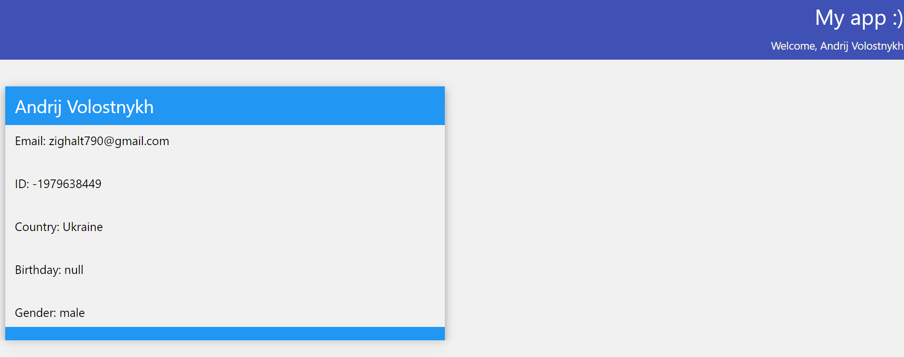
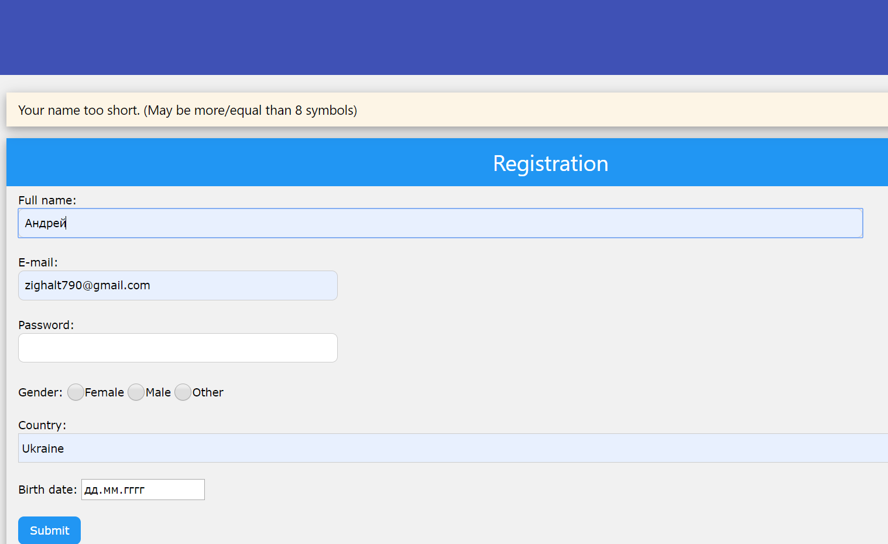
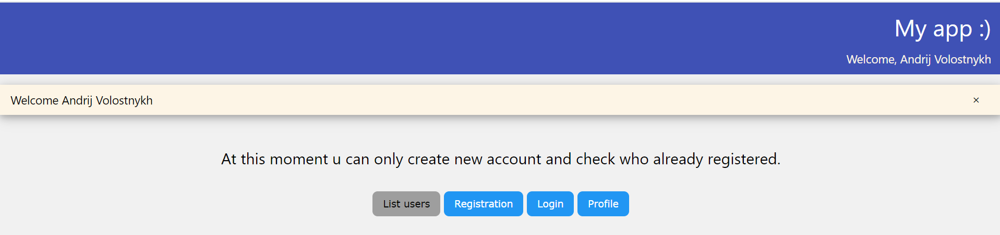

WEBATTEMPT My app:)
--------------------------------------------------------------------------------
This application created to get and training skills in  opportunities of Servlets, JDBC, JSP, JSTL and Tomcat.

What it can?
---------------------
Register user, login, show user profile, show list of users
Validation going on user Email. 

Last changes
---------------------

>(15.02.2020)
Final in CRUD and Servlets
 -User can change name, birthdate and password.
 -Added help page. 

>(10.02.2020)
Added confirmation of registration by email
  - Login bug fixed

>(08.02.2020)
Today application have laid on PostgreSQL using JDBC.
  - PostgreSQL and JDBC
  - Logout button
  - Delete profile
 (closer and closer to CRUD
 
---------------------

>(07.02.2020)

Today i have practiced HttpSession. With that class realised correct back-end logic. 
  - Encoding problems solved
  - Input data validation added
  - Login and authentification fixed and working well (U can watch profile after login anytime)
  - Wellcome to logined User in hedder
  - New design solutions

--------------------

>(06.02.2020)

At this moment application can register new users, login, show profile and show all users that registered.
Now i have a problem with encoding, it mean that cyrillic symbols have bad displaying. Profile button working only after login. If u reload page, profile will not display.

------------------

What in future?
---------------------
- Add to user photos and display that with posts and in profile. 
- May be add public or/and private chat. 
